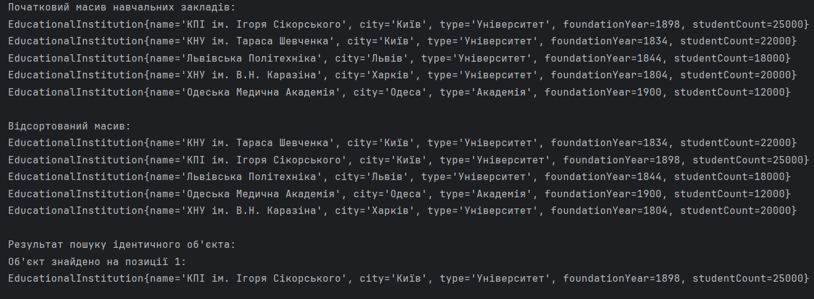

# Лабораторна робота №3 – Класи в Java

### Варіант: 11
C11 = 0 — клас "Навчальний заклад" (EducationalInstitution)

## Опис
- створення масиву об'єктів класу `EducationalInstitution`
  (назва, місто, тип, рік заснування, кількість студентів);
- сортування масиву стандартним методом `Arrays.sort(...)` з комбінованим компаратором:
    - спочатку за назвою навчального закладу (`name`) за зростанням;
    - якщо назви однакові — за кількістю студентів (`studentCount`) за спаданням;
- пошук в масиві об'єкта, ідентичного заданому, за всіма полями за допомогою перевизначеного методу `equals()`.
## Результат
